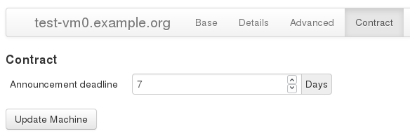
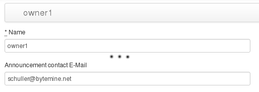
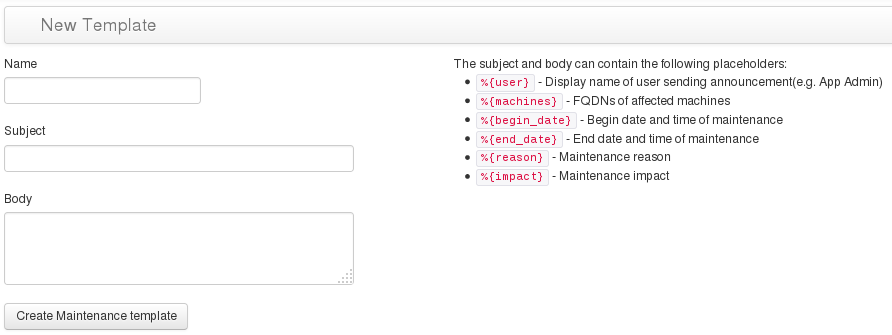
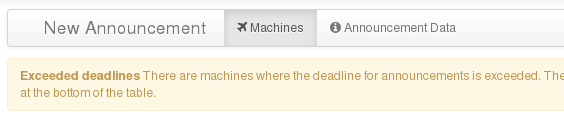
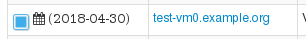

# Announcements

The announcement module provides functionality to send maintenance announcements to
customers. The announcements are customizable via a templating mechanism,
and respect deadlines specified for machines as per SLA. Depencencies from virtualized
machines to their respective virtualization hosts are also taken into account.

## Setting SLA deadlines

The deadline can be set individually for each machine. To set the deadline visit the
machines page, and go to the _Edit_ view. Here select the new point _Contract_ to
set the deadline. Save the machine once finished.

## Setting the owner contact

To have the announcements automatically send to the respective 
owner, a maintenance contact must be supplied. It is later used
as _CC_ for the created ticket.

The setting for this contact is in the details of the individual owner.
Go to the _Owners_ module, and select the entry to be modified.
In the details view, select _Edit_ and go to the new point _Contract_. Here you can set the e-mail-address which is used
to contact this owner. Again, save the owner when finished.

## Creating Templates

Templates are used to standardize messages send to customers.
They contain placeholders which are replaced with data from
actual announcements.

To create a new template, select the _Announcements_ module.
On the right side of the submenu, use _Templates_ to switch
to the template view. Here use _New Template_ to create a new
template. A template consists of a name for identifing
templates, a subject template and a body template. In both
templates, the placeholders explained at the right side can
be used. After saving the template, it can be used for announcements.

## Creating announcements

From the main view of the _Announcements_ module, select _New Announcement_. Now a list of machines is displayed, similar to the list of the _Machines_ module. Using the checkboxes in the first column, select the machines for which an announcement should be created. Switch to the _Announcement Data_ view. Here, give a _Reason_ and the _Impact_ of the maintenance. Select the start and end date of the maintenance and click on _Send announcement_.

### Errors

If there are constraints which disallow sending the announcement using the current parameters, the form will be shown again. The reasons why the announcement couldn't be send are shown above the list of machines.

 

Individual machines are marked with a symbol and additional information concerning the reason why sending the announcement was blocked. For example, if the deadline isn't held, a calendar icon and the first possible maintenance date is displayed:

 

 ### Success

 If the announcement was created successfully, you'll be shown the overview of announcements. Here you can see
 general information about the ticket, including the ticket IDs of the created _Request Tracker_ tickets.
 