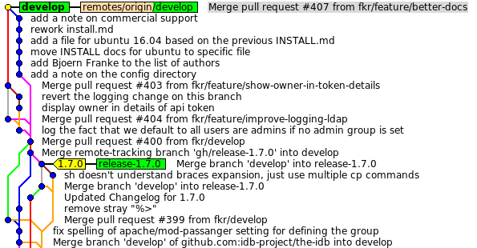

# Branches and Releases

## Branching scheme

We (try to) follow the branching scheme described at [A successful Git branching model](http://nvie.com/posts/a-successful-git-branching-model/).

Concise description:

- We have a _develop_ branch, containing the recent additions.
- New features and bugfixes are created in _feature_ branches, which are then merged in to the _develop_ branch. Usually these feature branches live in the repository of the developer who implements it, and are then merged to _develop_ via a GitHub PR. The branch name should be prefixed with the GitHub number of the concerning issue, like _1234-my-new-feature_. In the past we used the numbers of our internal issue tracking system, but for transparencys sake will switch to GitHub issue numbers, too.
- Releases have an own _release-$version_ branch, branched off from _develop_. The HEAD of this branch is tagged as _$version_ (e.g. 1.7.0).
- **Critical** bug fixes (e.g. security related) are merged / cherry picked into older releases as well.

In practice this then looks a bit like this:

## Releases
As mentioned before, releases get their own branch and are tagged with the version number. These _release-$version_ branches are then added for building and packaging by [packager.io](https://packager.io).

## In short
To contribute, fork the [main repository](https://github.com/idb-project/the-idb), switch to the development branch and create a new branch for the feature or bugfix you want to create. When done, submit a pull request on github, requesting to merge into develop.
